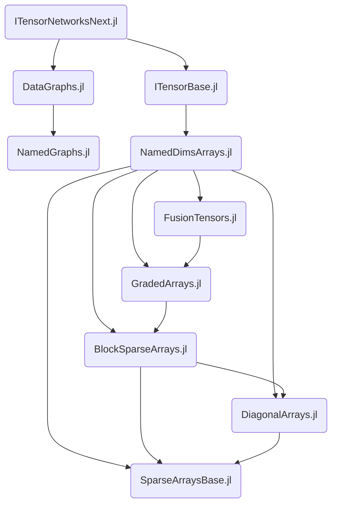

# ITensor Ecosystem Overview

```mermaid
graph TD
    ITensorNetworksNext(ITensorNetworksNext.jl) --> ITensorBase(ITensorBase.jl)
    ITensorNetworksNext --> DataGraphs(DataGraphs.jl)
    DataGraphs --> NamedGraphs(NamedGraphs.jl)
    ITensorBase --> NamedDimsArrays(NamedDimsArrays.jl)
    NamedDimsArrays --> SparseArraysBase(SparseArraysBase.jl)
    NamedDimsArrays --> DiagonalArrays(DiagonalArrays.jl)
    NamedDimsArrays --> BlockSparseArrays(BlockSparseArrays.jl)
    NamedDimsArrays --> GradedArrays(GradedArrays.jl)
    NamedDimsArrays --> FusionTensors(FusionTensors.jl)
    FusionTensors --> GradedArrays
    GradedArrays --> BlockSparseArrays
    BlockSparseArrays --> SparseArraysBase
    BlockSparseArrays --> DiagonalArrays
    DiagonalArrays --> SparseArraysBase
```
